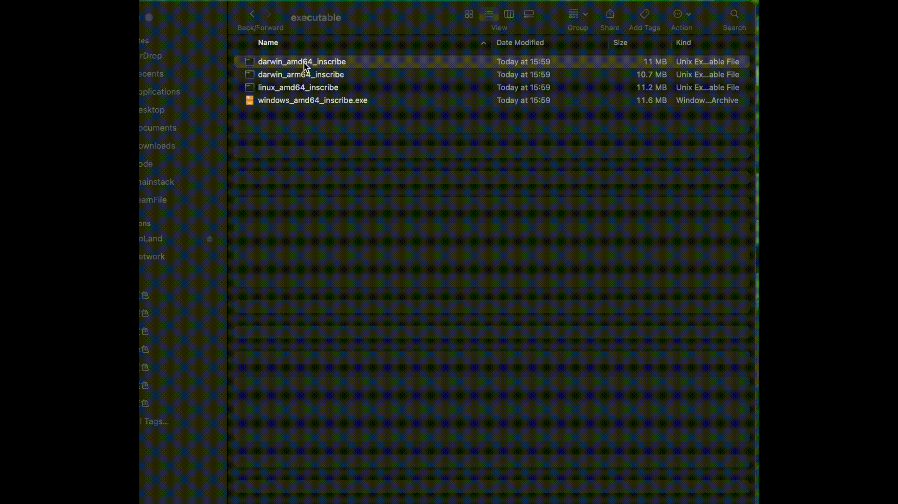

# ZAN Inscription Tool

Amidst the recent fervor surrounding significant blockchain inscriptions, the ZAN team envisions the introduction of an inscription tool project characterized by its user-friendly nature. Users are expected to securely partake in the mass inscription process, encountering minimal entry barriers.

This initiative unfolds as a collaborative undertaking within the community, inviting members to articulate their inscription needs. Competent developers, both within the ZAN team and the broader community, stand ready to assume tasks, thereby manifesting these requisites into reality.

The primary capability of this program lies in its ability to conduct batch inscriptions, eliminating the need for users to manually sign transactions through their wallets for on-chain submission. Currently, it only supports EVM-compatible chains, with non-EVM chains such as BTC set to be introduced shortly.

If you have any inquiries, feel free to raise an issue or contact us via email at service@zan.top.

## Quick Start

### Step 1 Acquire the Executable Program

- Directly download the executable program corresponding to your operating system.
- Alternatively, download the source code and execute `sh build.sh` from the "executable" directory tailored to your operating system.

### Step 2 Execute the Program

1. Double-click the executable program to prompt a dialog box. Await the appearance of the prompt: "Welcome to Use ZAN Inscription Tool."
2. Input your wallet private key. The program will never store or disclose your private key. 
3. Input your inscription original text data (not hex text).
4. Confirm the hex text data. If affirmative, input 'y'; otherwise, input 'n' and in the next step, input your hex data text.
5. After confirming your inscription content, input an rpcUrl provided by the node service provider. If not available, you can apply for a stable rpc URL for free from [ZAN Node Service](https://zan.top/home/node-service). 
6. Input gas price.
7. Input gas limit.
8. Specify the number of inscriptions needed.
9. Input the time interval for each inscription.
10. Await program execution.
11. Retrieve the transaction hash for the inscription from the dialog box.

